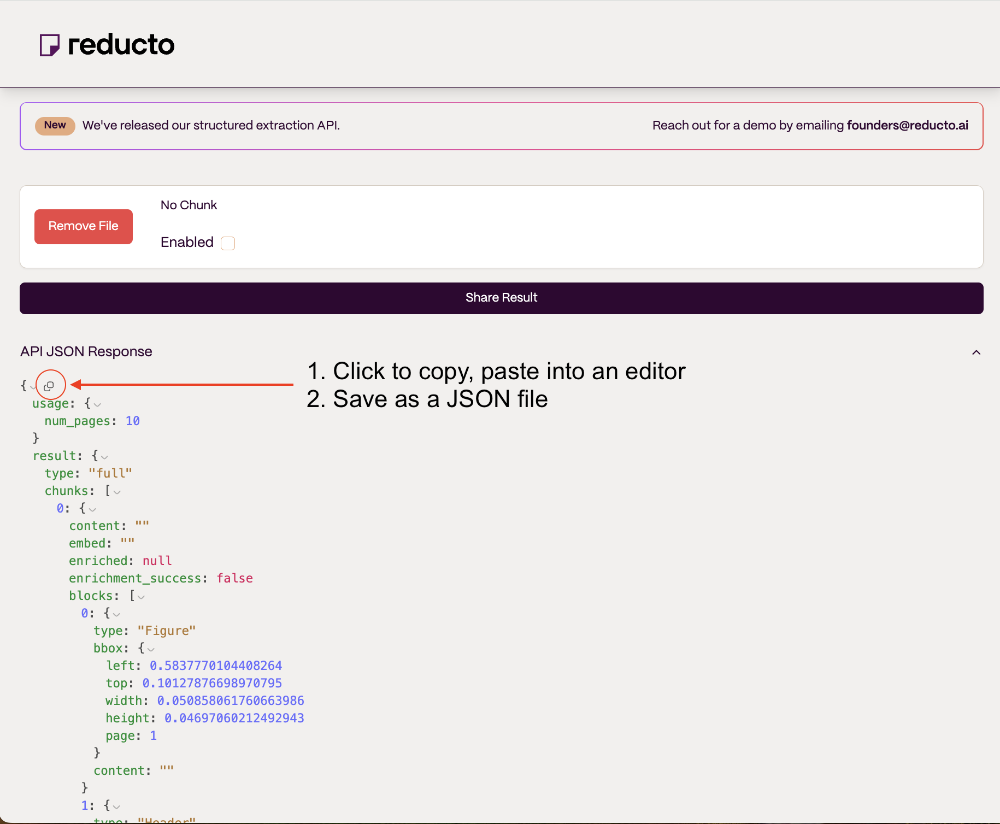

# Legal Document RAG: Multi-Graph Multi-Agent Recursive Retrieval through Clauses
## Setup
- Instructions are in the notebook `legal_recursive_retrieval.ipynb`
- Create a venv if desired
  - `python3 -m venv venv`
  - `source venv/bin/activate`
- Run `pip install -r requirements.txt` to install the necessary packages.

## Important
- If you are providing a workspace, it should be empty and should only contain documents used build the lexical graph.

## Integration with Reducto

- As of the notebook's creation date, any developers interested in the Reducto API must reach out to founders to get a key for the demo. 
- However, the [free demo on the website](https://app.reducto.ai/) allows up to 10 pages of text to be analyzed
- The API response JSONs can be copied and saved as `<pdf filename without extension>.json` under `docs_structure/reducto/`. 

- In our example, `bnm_compliance.pdf` in `/docs` was saved as `bnm_compliance.json` in `/docs_structure/reducto/`.
- This already has been done for you so you can run the notebook as-is – follow the steps above if you want to try with your own documents.
